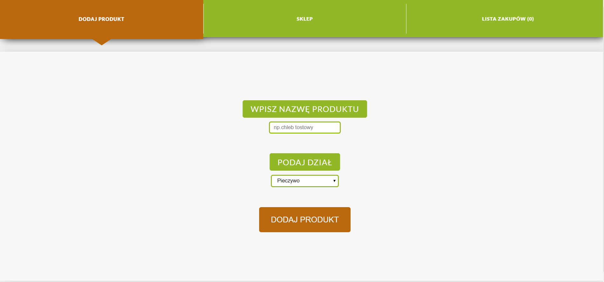

# Shopping List

This was my first React aplication ment to teach me basics of React and React Router.
It was made with **mobile first** approach.

In order to see a demo visit [this link](https://tompod92.github.io/Shopping-List/#/pageShop)



---

## About the App

It allows the user to add a product to shop (to specific section).
Apart from that you can add as many product to your shopping list or delete them from the shop.
In the "lista zakupow" tab you can brows through that shopping list and mark each products as bought or delete it from the list.
All three tabs were made using React Router.

---

## In order to few the source code download/clone this repository

```bash
npm install
npm run start
```
